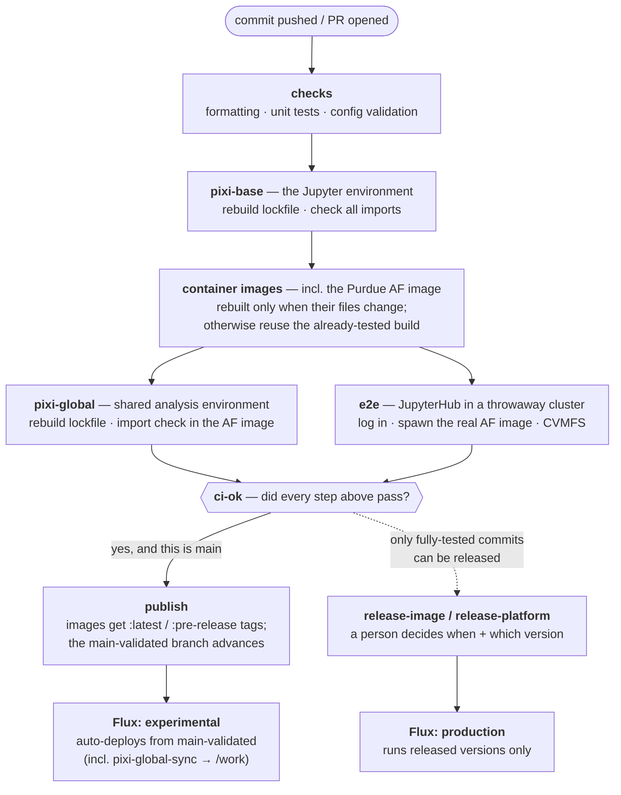

# CI/CD at a glance

Every commit goes through one pipeline ([ci.yml](ci.yml)). Nothing reaches
users unless every step passed for that exact commit. Automation stops at
the pre-release channel — putting things into production is always a human
decision (see [RELEASING.md](../../RELEASING.md)).

