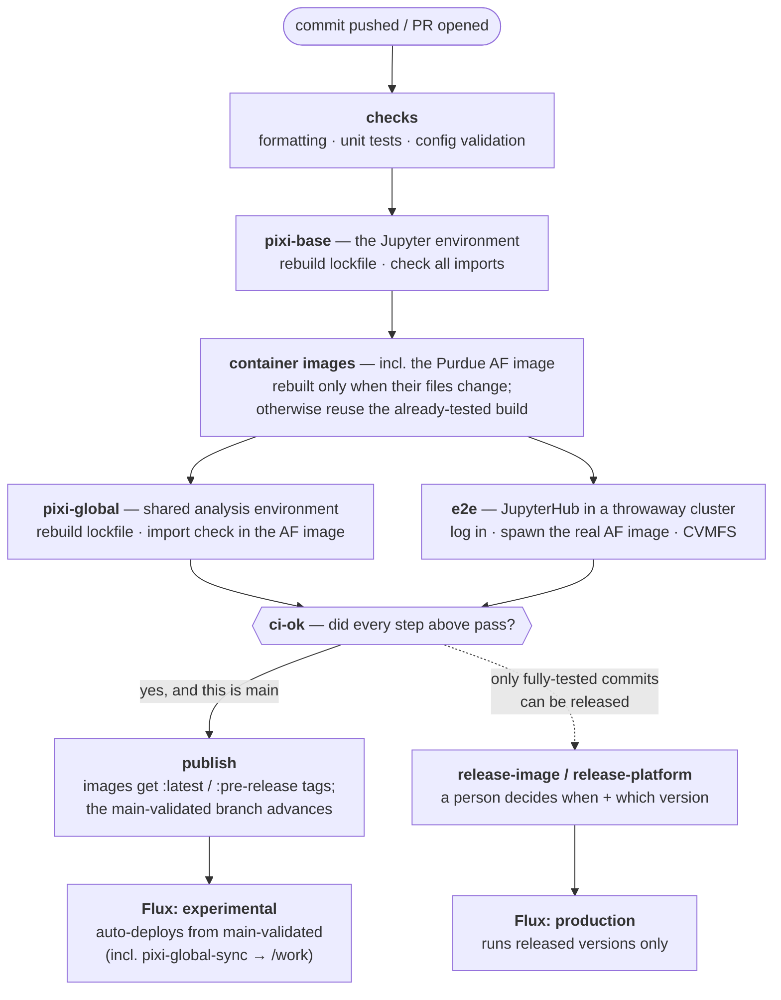

# Releasing

The Purdue AF has **two human-minted version streams** and a set of
CI-owned continuous channels. Each stream is minted by exactly one
workflow — never create version tags by hand, and never move channel tags
by hand.

| Stream                                                | Scheme                            | Example    | Minted by                                          | Reaches production                                           |
| ----------------------------------------------------- | --------------------------------- | ---------- | -------------------------------------------------- | ------------------------------------------------------------ |
| **Platform** (everything Flux deploys)                | CalVer `YYYY.M.SEQ`               | `2026.7.8` | **Release platform** workflow                      | immediately — production Flux tracks the newest `2026.x` tag |
| **purdue-af image**                                   | semver `0.X.Y`, repo tag `v0.X.Y` | `v0.13.0`  | **Release image** workflow                         | at the **next platform release**                             |
| Continuous (`:latest`, `:pre-release`, `in-`, `sha-`) | moving tags                       | —          | `ci.yml` publish stage only, behind the ci-ok gate | on pod restart / session spawn                               |
| Experimental Flux source (`main-validated`)           | CI-owned moving branch            | —          | `ci.yml` publish stage only, behind the ci-ok gate | experimental Flux reconcile (~1 min)                         |

All auxiliary images (agentic-interface, af-pod-monitor, af-node-monitor)
are on the continuous `:latest` channel — unversioned, no release step:
every fully green pipeline on `main` moves `:latest`, and the cluster
picks it up on the next pod restart.

## The pipeline at a glance

Every commit runs one pipeline ([ci.yml](.github/workflows/ci.yml));
nothing is published unless every step passed for that exact commit.
Automation stops at the pre-release channel — production is always one
of the manual releases described below.



## Platform releases (the frequent one)

Mint a platform tag **whenever core components need to reach the
production namespace**: hub configuration, monitoring, cronjobs, manifest
changes — anything under the core Flux environment. (Experimental
components track the CI-owned `main-validated` branch and never need a
platform release.)

1. **Actions → Release platform → Run workflow** — computes the next
   `YYYY.M.SEQ`, tags, and publishes a GitHub Release with generated
   notes. No file edits, no image tags.
2. Production Flux advances to the tagged commit within ~1 minute.

**Rollback**: deleting the most recent platform Release _together with
its tag_ rolls production back — Flux tracks the newest `2026.x` **git
tag**, so once the tag is gone it re-resolves to the previous one and
re-applies that commit's manifests on the next reconcile (~1 min). The
previous GitHub Release automatically becomes "latest" again.

```
gh release delete 2026.7.9 --cleanup-tag   # --cleanup-tag is what matters
```

Deleting only the Release object (without the tag) rolls back **nothing**.
And this is a rollback of production, not of history: `main` still
contains the offending commits — fix or revert them before minting the
next tag, or the next release re-ships them. Never use tag deletion for
`v*` image releases: the image pin lives in a values.yaml commit, so
deleting a `v` tag rolls back nothing (revert the release commit instead).

## purdue-af image releases

Release when the content soaking as `:pre-release` should become the
default production environment. Bump rules:

- **major** — never, until the AF moves from R&D to Operations mode;
- **minor** — breaking changes for users, or a major change to the AF
  codebase;
- **patch** — any other release of new content to users (no breaking
  changes).

Preconditions, enforced by the workflow (bypass only with `force`):
`ci-ok` green on main HEAD, and the `:pre-release` digest identical to the
image of the current repo state. Complete the manual checklist in
[docker/purdue-af/README.md](docker/purdue-af/README.md) first.

1. **Actions → Release image → Run workflow** — choose the bump (or an
   explicit `version`). The workflow verifies both gates, adds the semver
   tag to the **same digest** that passed CI (never a rebuild), rewrites
   every version spot in values.yaml (`bump-af-version.py`,
   count-verified), commits to `main`, tags `v<version>`, and publishes a
   GitHub Release.
2. **Actions → Release platform → Run workflow** — the bump commit
   reaches production only when a platform tag covers it; this is always
   the second step of an image release.

**Rollback**: `git revert` the release commit on `main`, then mint a new
platform tag. Old semver tags stay on ghcr forever; the registry GC never
deletes release tags.

## Rules of the road

- Channel tags (`:latest`, `:pre-release`), build tags (`in-`, `sha-`),
  and the experimental Flux branch (`main-validated`) are CI-owned: they
  move only in the `ci.yml` publish stage, after every stage of the same
  commit is green. Hand-moving them defeats the gates. Retired pointers:
  tag `main-ci-passed` (blocked from recreation), custom ref
  `refs/ci/main-passed`, and branch `ci/main-passed`. If you have a local
  tag copy, `git tag -d main-ci-passed`.
- The `AF_RELEASE_TOKEN` secret (fine-grained PAT, `contents: write`)
  must exist — release commits/tags pushed with the default
  `GITHUB_TOKEN` do not trigger CI, so the release commit would go
  unvalidated.
- Version badges in the README read the platform tag list and
  `apps/jupyterhub/jupyterhub/values.yaml` — they update on their own;
  nothing to edit.
