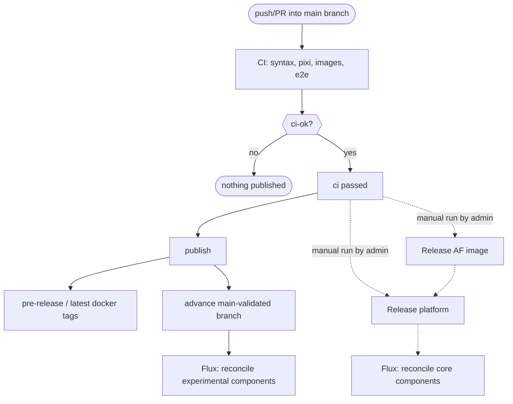

# Releasing

Two version streams are minted by hand, one automatically; everything else is
CI-owned. Never create a version tag or move a channel tag by hand.

| Stream                                                | Scheme                            | Minted by                              | Reaches the cluster                                    |
| ----------------------------------------------------- | --------------------------------- | -------------------------------------- | ------------------------------------------------------ |
| **Platform** (everything Flux deploys)                | CalVer `YYYY.M.SEQ` (`2026.7.8`)  | **Release platform** workflow          | immediately — core Flux tracks the newest `2026.x` tag |
| **purdue-af image**                                   | semver `v0.X.Y` (`v0.13.0`)       | **Release image** workflow             | at the next platform release                           |
| **agentic-interface image**                           | semver `agentic-interface-vX.Y.Z` | `ci.yml` publish stage — **automatic** | when the auto-release commit passes CI (~one CI round) |
| Continuous (`:latest`, `:pre-release`, `in-`, `sha-`) | moving tags                       | `ci.yml` publish stage, behind `ci-ok` | on pod restart / session spawn                         |
| Experimental Flux source (`main-validated`)           | moving branch                     | `ci.yml` publish stage, behind `ci-ok` | experimental Flux reconcile (~1 min)                   |

The monitor images (af-pod-monitor, af-node-monitor) have no release step at
all: every green pipeline on `main` moves `:latest`. The agentic-interface
image also publishes to `:latest` continuously, but its Deployment pins a
released semver tag — the pod moves only when an auto-release rewrites the pin.

## How changes reach the cluster

| Change                                            | Path to the cluster                                                                                                         |
| ------------------------------------------------- | --------------------------------------------------------------------------------------------------------------------------- |
| Core component (hub config, monitoring, cronjobs) | push to `main` → CI green → mint new platform tag (manual) → core Flux reconciles (~1 min)                                  |
| AF image content (Dockerfile, `pixi/base`)        | push to `main` → CI builds + e2e → `:pre-release` moves → mint new image version (manual), then a new platform tag (manual) |
| Experimental component                            | push to `main` → CI green → publish advances `main-validated` → experimental Flux reconciles (~1 min)                       |
| Global env (`pixi/global`)                        | push to `main` → CI validates the lock → `pixi-global-sync` applies it to `/work/pixi/global`                               |
| agentic-interface image                           | push to `main` → CI green → publish auto-releases the next patch version → bump commit CI green → Flux rolls pod            |
| Monitor images (af-pod-monitor, af-node-monitor)  | push to `main` → CI green → `:latest` moves → pod restart picks it up                                                       |

Every commit runs one pipeline ([ci.yml](.github/workflows/ci.yml)) and
nothing is published unless every stage passed for that exact commit. The
publish stage runs on `main` only; the two releases are `workflow_dispatch`
runs from the Actions tab.


```mermaid
flowchart TD
  push(["push/PR into main branch"]) --> checks["CI: syntax, pixi, images, e2e"]
  checks --> ok{{"ci-ok?"}}
  ok -->|no| stop(["nothing published"])
  ok -->|yes| passed["ci passed"]
  passed --> pub["publish"]
  pub --> tags["pre-release / latest docker tags"]
  pub --> mv["advance main-validated branch"]
  mv --> exp["Flux: reconcile experimental components"]
  passed -.->|manual run by admin| img["Release AF image"]
  passed -.->|manual run by admin| plat["Release platform"]
  img -.-> plat
  plat -.-> core["Flux: reconcile core components"]
```

## Platform release

Mint one whenever core components need to reach the cluster: hub
configuration, monitoring, cronjobs, manifest changes. (Experimental
components track `main-validated` and never need one.)

**Actions → Release platform → Run workflow** computes the next
`YYYY.M.SEQ`, tags it, and publishes a GitHub Release with generated notes —
no file edits, no image tags. Core Flux advances within ~1 minute.

**Rollback**: delete the newest Release _together with its tag_. Flux tracks
the newest `2026.x` **git tag**, so it re-resolves to the previous one and
re-applies that commit on the next reconcile.

```
gh release delete 2026.7.9 --cleanup-tag   # --cleanup-tag is what matters
```

Deleting the Release object alone rolls back **nothing**. And this rolls back
what is deployed, not history: `main` still contains the offending commits —
fix or revert them, or the next tag re-ships them.

## purdue-af image release

Release when the content soaking as `:pre-release` should become the default
session environment. **major** — never, until the AF moves from R&D to
Operations; **minor** — breaking changes for users, or a major change to the
codebase; **patch** — anything else.

Preconditions, enforced by the workflow (bypass only with `force`): `ci-ok`
green on main HEAD, and the `:pre-release` digest identical to the image of
the current repo state. Complete the manual checklist in
[docker/purdue-af/README.md](docker/purdue-af/README.md) first.

1. **Actions → Release image → Run workflow** — choose the bump (or an
   explicit `version`). It adds the semver tag to the **same digest** that
   passed CI (never a rebuild), rewrites every version spot in values.yaml
   (`bump-af-version.py`, count-verified), commits to `main`, tags
   `v<version>`, and publishes a Release.
2. **Actions → Release platform → Run workflow** — always the second step:
   the bump commit reaches the cluster only once a platform tag covers it.

**Rollback**: `git revert` the release commit on `main`, then mint a new
platform tag. Never delete a `v*` tag — the pin lives in a values.yaml
commit, so deleting the tag rolls back nothing. Old semver tags stay on ghcr
forever; the registry GC never deletes release tags.

## agentic-interface image auto-release

No button. The publish stage of every green `main` pipeline checks whether
the digest it just validated (`in-<hash>` of the tested tree) is what
[apps/agentic-interface/deployment.yaml](apps/agentic-interface/deployment.yaml)
pins. If not, it mints the next version: promotes that exact digest to a bare
`X.Y.Z` tag on ghcr (never a rebuild), rewrites the Deployment pin
(`bump-agentic-version.py`, count-verified), pushes an `auto-release` commit
to `main`, and tags `agentic-interface-v<version>`. The bump commit's own CI
(everything memoized except the cheap checks) then advances `main-validated`,
and experimental Flux rolls the pod onto the released tag — merge → deployed
version in about one extra CI round, with no human step.

The bump kind is chosen automatically: **minor** when the skill
(`.claude/skills/purdue-af-agentic-interface` — the user-facing contract of
the MCP server, and an input of the image hash) changed since the last
release, **patch** otherwise. So a skill-only change still mints and deploys
a new version, and the version number tells users whether their side of the
interface moved. Major versions are never minted automatically; if one is
ever wanted, `--set` it by hand in a normal commit and let CI validate it.

The bump commit changes only the Deployment (not an image input), so its own
publish run sees digest == pin and no-ops — the cycle terminates after one
bump. `AF_RELEASE_TOKEN` is REQUIRED for this path: the step fails loudly
rather than pushing a bump commit that would never trigger CI.

Note the deploy is `strategy: Recreate` (stateful in-process MCP sessions),
so each auto-release drops in-flight MCP sessions for a few seconds.

**Rollback**: `git revert` the CODE commit that produced the bad image — not
the auto-release commit (the digest check would just re-bump onto the same
bad image). The reverted tree hashes back to the previous good image, and the
next pipeline auto-releases a new patch version pointing at those good bytes.
Never delete an `agentic-interface-v*` tag.

## Rules of the road

- Channel tags (`:latest`, `:pre-release`), build tags (`in-`, `sha-`) and
  `main-validated` move only in the `ci.yml` publish stage, after every stage
  of the same commit is green. Hand-moving them defeats the gates.
- The `AF_RELEASE_TOKEN` secret (fine-grained PAT, `contents: write`) must
  exist: commits and tags pushed with the default `GITHUB_TOKEN` do not
  trigger CI, so a release commit would go unvalidated.
- README version badges update themselves. The per-component status badges do
  too (`component-status.yml`), but their README list is static — adding or
  removing a component means editing that list, and the unit tests fail until
  you do.
