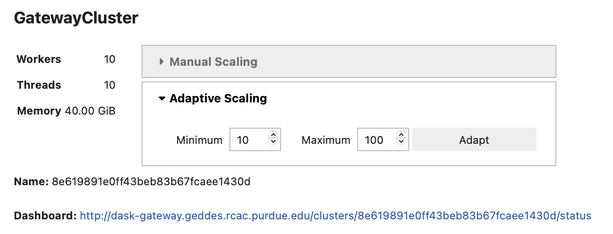

# Dask Gateway cluster setup

**Initialize the `gateway` object.** It will be used to interact with your Dask
clusters.

```python
import os
from dask_gateway import Gateway

# To submit workers via Kubernetes (all users):
gateway = Gateway()

# To submit workers via Slurm (Purdue users only!):
# gateway = Gateway(
#     "http://dask-gateway-k8s-slurm.geddes.rcac.purdue.edu/",
#     proxy_address="api-dask-gateway-k8s-slurm.cms.geddes.rcac.purdue.edu:8000",
# )
```

**Create a new cluster.**

```python
# You may need to update some environment variables before creating a cluster.
# For example:
os.environ["X509_USER_PROXY"] = "/path-to-voms-proxy/"

# Create the cluster
cluster = gateway.new_cluster(
    pixi_project = "/path/to/pixi/project", # path to pixi project (directory containing pixi.toml file)
    # conda_env = "/path/to/conda/environment", # path to conda environment - can be used instead of pixi_project
    worker_cores = 1,    # cores per worker
    worker_memory = 4,   # memory per worker in GB
    env = dict(os.environ), # pass environment as a dictionary
)

cluster
```

*This is how the widget for the Dask Gateway cluster will look, if the cluster is
created successfully:*
<div>

</div>

* Use adaptive (recommended) or manual scaling to create Dask workers.
* Click on the dashboard link to open the Dask dashboard.
* To access worker logs, click on the "Info" tab in the Dask dashboard.

**Check if you already have clusters running:**

```python
# List available clusters
clusters = gateway.list_clusters()
print(clusters)
```

**Shut down the cluster.**

```python
cluster.shutdown()

# Or shut down a specific cluster by name:
# cluster_name = "b2aec555e2f844d68a5febd6c5d1414e"   # paste cluster name here
# gateway.connect(cluster_name).shutdown()
```

**Shut down all clusters:**

```python
for cluster_info in gateway.list_clusters():
    gateway.connect(cluster_info.name).shutdown()
```

!!! note "See also"

    [Dask Gateway at Purdue AF](../guide-dask-gateway.md) — full documentation,
    including worker storage access and environment propagation.
