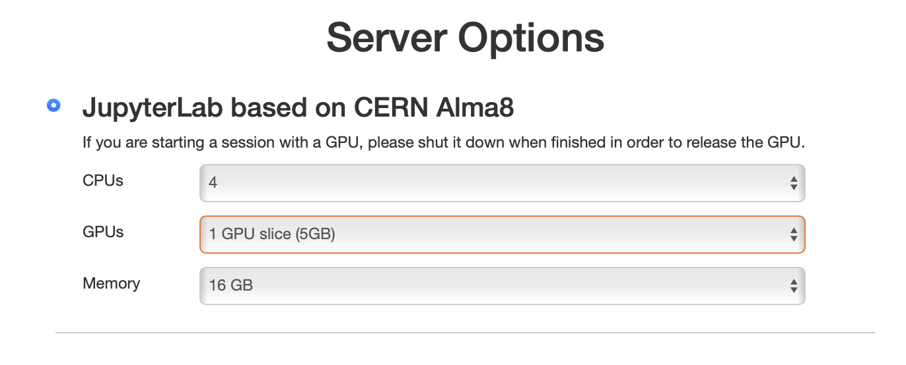

# GPU access

**Graphics processing units (GPUs)** are specialized processors that can
dramatically accelerate execution of parallelizable algorithms.

The most common use cases for GPUs in high energy physics are **training** and
**inference** of machine learning models, however there are other frameworks and
algorithms optimized to run on GPUs. For example, Purdue AF also allows you to use
GPUs to [accelerate RooFit fits](guide-roofit-cuda.md).

## How to access GPUs at Purdue AF

### 1. Direct connection

You can start an AF session with interactive access to an **Nvidia A100** GPU by
selecting it at the resource selection step (see screenshot below). You will have
a choice of either a 5 GB "slice" of an A100, or a full 40 GB A100.

<figure markdown="span">
  { width="500" }
</figure>

| Configuration        | Memory | Number of instances | Availability |
| -------------------- | ------ | ------------------- | ------------ |
| 5 GB "slice" of A100 | 5 GB   | 14                  | Usually immediate |
| Full A100 GPU        | 40 GB  | 4                   | Subject to availability |

!!! tip

    The resource selection form shows the **current availability** of each GPU
    configuration next to the corresponding option, so you can see before starting
    the session whether a full A100 is free.

!!! note

    If you selected a GPU, your session will have `CUDA 12.4` and `cudnn 8.9.7.29`
    libraries loaded. Take this into account if you need to install particular
    versions of ML libraries such as `tensorflow` — these libraries are notoriously
    sensitive to the CUDA version.

!!! important

    Please terminate your session after using a GPU in order to release it for
    other users. Full 40 GB A100 instances are in short supply.

### 2. Slurm jobs (Purdue users only)

You can use Slurm to submit multiple GPU jobs to run in parallel. To request a GPU
for a Slurm job, simply add the `--gpus-per-node=1` argument to the `sbatch` command.

* Slurm jobs submitted directly from the Purdue AF interface are executed on the
  Hammer cluster, which features 22 nodes with **Nvidia T4** GPUs.
* If you need more GPUs, or different GPU models, consider submitting Slurm jobs
  on the [Gilbreth cluster](https://www.rcac.purdue.edu/compute/gilbreth).
  To log in to Gilbreth directly from the Purdue AF interface, simply run
  `ssh gilbreth` and use BoilerKey two-factor authentication. Once logged in, you
  can use the Slurm queues on Gilbreth to run GPU jobs.

    !!! important

        The **only** storage volume shared between Purdue AF and the Gilbreth
        cluster is `/depot/` — save the outputs of your jobs there.

## GPU support in common ML libraries

* **PyTorch** — does not require any special installation, as long as its version
  supports `CUDA 12.4` and `cudnn 8.9.x` (this is already true for the
  [global Pixi environment](software.md)).
  See the [PyTorch CUDA semantics documentation](https://pytorch.org/docs/stable/notes/cuda.html).

* **TensorFlow**:

    1. Install `tensorflow[and-cuda]` using `pip` (already done in the
       [global Pixi environment](software.md)).
    2. Learn how to use TensorFlow with GPUs:
       [TensorFlow GPU guide](https://www.tensorflow.org/guide/gpu).

* **XGBoost** — enable GPU support by setting the `device` parameter to `cuda`.
  Refer to the
  [XGBoost GPU documentation](https://xgboost.readthedocs.io/en/stable/gpu/index.html)
  for details.

You can verify that your session sees the GPU with `nvidia-smi`, or from Python:

```python
import torch
print(torch.cuda.is_available())
print(torch.cuda.get_device_name())
```

If you experience any issues, or are missing any ML libraries, please
[contact Purdue AF support](support.md).
