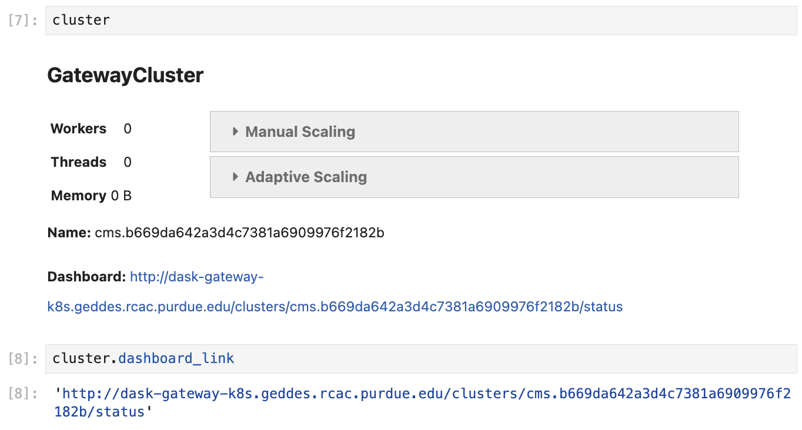

# Dask Gateway at Purdue AF

Dask Gateway is a service that allows users to manage Dask clusters in a
multi-tenant environment such as the Purdue Analysis Facility.

There are two types of Dask Gateway clusters that can be created:

* **Dask Gateway cluster with Slurm backend** — workers are submitted as Slurm jobs
  to a Purdue community cluster: **Hammer**, or (more recently) **Gautschi**.
  This is available to **Purdue users only**, due to Purdue data access policies.

    With this method, users can create **hundreds of workers**, although requesting
    more than 200–300 workers is usually associated with some wait time due to
    competition with CMS production jobs and other users.

* **Dask Gateway cluster with Kubernetes backend** — workers are submitted to the
  Purdue Geddes cluster. This is available to **all users**.

    With this method, the workers are scheduled almost instantly, but for now we
    restrict each cluster to **200 workers, 200 cores, and 1.2 TB RAM** due
    to limited resources in the Analysis Facility.

!!! important "One cluster at a time"

    Each user can have **at most one active Dask Gateway cluster** per gateway at
    a time. If cluster creation fails with a message about an existing cluster,
    shut the old cluster down (or wait for it to finish stopping) first.

The pros and cons of the two backends are summarized in the following table:

|          | Dask Gateway + Slurm | Dask Gateway + Kubernetes |
| -------- | -------------------- | ------------------------- |
| **Pros** | • Slurm is familiar to current users<br>• Easy to access logs and worker info via `squeue` | • Fast scheduling of resources<br>• Detailed monitoring<br>• Available to CERN/FNAL users |
| **Cons** | • Unavailable to CERN/FNAL users<br>• Scheduling workers can be slow due to competition with CMS production jobs | • Limited total amount of resources<br>• Retrieving detailed worker info can be non-trivial for users (but easy for admins) |

## 1. Creating Dask Gateway clusters

To create a Dask Gateway cluster, you first connect to the Gateway server via a
`Gateway` object, and then use the `Gateway.new_cluster()` method.

Calling `Gateway()` without arguments connects you to the server with the
**Kubernetes backend**. In order to use the **Slurm** backend, you need to specify
the server URL explicitly (see code below).

While it is possible to create a cluster in a Python script, we recommend that you
instead do it from a separate Jupyter Notebook — that way the same cluster can be
reused multiple times without restarting.

```python
import os
import dask_gateway
from dask_gateway import Gateway

# To submit workers via Kubernetes (all users):
gateway = Gateway()

# To submit workers via Slurm to the Hammer cluster (Purdue users only!):
# gateway = Gateway(
#     "http://dask-gateway-k8s-slurm-hammer.geddes.rcac.purdue.edu/",
#     proxy_address="api-dask-gateway-k8s-slurm-hammer.cms.geddes.rcac.purdue.edu:8000",
# )

# To submit workers via Slurm to the Gautschi cluster (Purdue users only!):
# gateway = Gateway(
#     "http://dask-gateway-k8s-slurm-gautschi.geddes.rcac.purdue.edu/",
#     proxy_address="api-dask-gateway-k8s-slurm-gautschi.cms.geddes.rcac.purdue.edu:8000",
# )

# You may need to update some environment variables before creating a cluster.
# For example:
os.environ["X509_USER_PROXY"] = "/path-to-voms-proxy/"

# Create the cluster
cluster = gateway.new_cluster(
    pixi_project = "/path/to/pixi/project", # path to pixi project (directory containing pixi.toml file)
    # conda_env = "/path/to/conda/environment", # path to conda environment - can be used instead of pixi_project
    worker_cores = 1,    # cores per worker
    worker_memory = 4,   # memory per worker in GB
    env = dict(os.environ), # pass environment as a dictionary
)

# If working in a Jupyter Notebook, the following will create a widget
# which can be used to scale the cluster interactively:
cluster
```

!!! note "Worker size limits"

    A single worker can request at most **64 GB of memory**, and at most
    **64 cores** (Kubernetes backend) or **16 cores** (Slurm backend).
    For most analyses, many small workers (1–4 cores each) work better than a
    few large ones.

## 2. Shared environments and storage volumes

There are multiple ways to ensure that the workers have access to specific storage
volumes, Pixi or Conda environments, Python packages, C++ libraries, etc.

* **Shared storage**

    Dask workers have the same permissions as the user that creates them. You can
    use this to your advantage if your workers read/write data to/from storage
    locations.

    Refer to the following table to decide which Dask Gateway setup works best in
    your case:

    |            | Slurm workers (Purdue users) | Kubernetes workers (Purdue users) | Kubernetes workers (CERN/FNAL users) |
    | ---------- | ---------------------------- | --------------------------------- | ------------------------------------ |
    | **/home/** | no access                    | no access                         | no access                            |
    | **/work/** | no access                    | read / write                      | read / write                         |
    | **Depot**  | read / write                 | read / write                      | read-only                            |
    | **CVMFS**  | read-only                    | read-only                         | read-only                            |
    | **EOS**    | read-only                    | read-only                         | read-only                            |

* **Pixi or Conda environments / Jupyter kernels**

    Any Pixi or Conda environment used in your analysis can be propagated to the
    Dask workers. The only caveat is that the workers must have read access to the
    storage volume where the environment is stored (see table above). For example,
    Slurm workers will not be able to see Pixi or Conda environments located in
    `/work/` storage.

    The path to the Pixi project is specified in the `pixi_project` argument of
    `new_cluster()`:

    ```python
    cluster = gateway.new_cluster(
        pixi_project = "/path/to/pixi/project", # path to pixi project (directory containing pixi.toml file)
        # ...
    )
    ```

    If you are using a multi-environment Pixi project, you can specify the
    environment name in the `pixi_env` argument (`default` if not specified):

    ```python
    cluster = gateway.new_cluster(
        pixi_project = "/path/to/pixi/project",
        pixi_env = "my-env", # pixi environment name
        # ...
    )
    ```

    If using a Conda environment, specify its location in the `conda_env` argument
    (mutually exclusive with `pixi_project` and `pixi_env`):

    ```python
    cluster = gateway.new_cluster(
        conda_env = "/path/to/conda/environment", # path to conda environment
        # ...
    )
    ```

* **Environment variables**

    Passing environment variables to workers can be beneficial in various ways,
    for example:

    * enable imports from local Python (sub)modules by amending the `PYTHONPATH` variable;
    * enable imports from C++ libraries by amending the `LD_LIBRARY_PATH` variable;
    * allow workers to read data via XRootD by specifying the path to a VOMS proxy
      via the `X509_USER_PROXY` variable.

    The `gateway.new_cluster()` command takes an `env` argument which can be used
    to pass any set of environment variables to the workers. The most
    straightforward way to use this is to pass the entire local environment:

    ```python
    os.environ["X509_USER_PROXY"] = "/path-to-proxy"

    cluster = gateway.new_cluster(
        #...
        env = dict(os.environ)
    )
    ```

    !!! important

        For CERN and FNAL users, the dictionary passed to the `env` argument must
        contain the elements `"NB_UID"` and `"NB_GID"`. **This is already satisfied
        when you pass** `env = dict(os.environ)`, **so no further action is needed.**

        However, if you want to pass a custom environment to the workers, you can
        add the required elements as follows:

        ```python
        env = {
            "NB_UID": os.environ["NB_UID"],
            "NB_GID": os.environ["NB_GID"],
            # other environment variables...
        }
        ```

## 3. Monitoring

Monitoring your Dask jobs is possible in two ways:

1. Via the Dask dashboard, which is created for each cluster (see below).
2. Via the general Purdue AF monitoring page, in the "Slurm metrics" and "Dask
   metrics" sections of the
   [monitoring dashboard](https://cms.geddes.rcac.purdue.edu/grafana/d/purdue-af-dashboard/purdue-analysis-facility-dashboard){ target="_blank" }.

When a cluster is created in a Jupyter Notebook, you can extract the link to the
dashboard either from the Dask Gateway widget, or from `cluster.dashboard_link`.

To create the widget, simply execute a cell containing a reference to the cluster
object, as shown in the screenshot:

<figure markdown="span">
  { width="700" }
</figure>

## 4. Cluster discovery and connecting a client

In general, connecting a client to a Gateway cluster is done as follows:

```python
client = cluster.get_client()
```

However, this implies that `cluster` refers to an already existing object. This is
true if the cluster was created in the same notebook, but in most cases we
recommend keeping the cluster separate from the clients.

Below are the different ways to connect a client to a cluster created elsewhere:

=== "Automatic cluster discovery"

    This snippet allows you to discover the cluster and connect to it
    automatically, as long as the cluster exists.

    ```python
    from dask_gateway import Gateway

    # If submitting workers as Kubernetes pods (all users):
    gateway = Gateway()

    # If submitting workers as Slurm jobs to Hammer (Purdue users only):
    # gateway = Gateway(
    #     "http://dask-gateway-k8s-slurm-hammer.geddes.rcac.purdue.edu/",
    #     proxy_address="api-dask-gateway-k8s-slurm-hammer.cms.geddes.rcac.purdue.edu:8000",
    # )

    clusters = gateway.list_clusters()
    # for example, select the first of the existing clusters
    cluster_name = clusters[0].name
    client = gateway.connect(cluster_name).get_client()
    ```

    !!! caution

        If you have more than one Dask Gateway cluster running, automatic detection
        may be ambiguous.

=== "Manual connection"

    This is the most straightforward method of connecting to a specific cluster.
    It is useful if you have more than one cluster running and need to ensure that
    you are connecting to the correct one.

    ```python
    from dask_gateway import Gateway

    # If submitting workers as Kubernetes pods (all users):
    gateway = Gateway()

    # If submitting workers as Slurm jobs to Hammer (Purdue users only):
    # gateway = Gateway(
    #     "http://dask-gateway-k8s-slurm-hammer.geddes.rcac.purdue.edu/",
    #     proxy_address="api-dask-gateway-k8s-slurm-hammer.cms.geddes.rcac.purdue.edu:8000",
    # )

    # To find the cluster name:
    print(gateway.list_clusters())

    # replace with actual cluster name:
    cluster_name = "17dfaa3c10dc48719f5dd8371893f3e5"
    client = gateway.connect(cluster_name).get_client()
    ```

## 5. Shutting down clusters

When you are done, shut the cluster down to release the resources for other users:

```python
cluster.shutdown()

# Or shut down a specific cluster by name:
# gateway.connect("17dfaa3c10dc48719f5dd8371893f3e5").shutdown()

# Or shut down all your clusters:
for cluster_info in gateway.list_clusters():
    gateway.connect(cluster_info.name).shutdown()
```

## 6. Cluster lifetime and timeouts

* Cluster creation will fail if the scheduler doesn't start within **3 minutes**
  (Kubernetes backend) or **10 minutes** (Slurm backend). If this happens, try to
  resubmit the cluster.
* An idle cluster (no connected clients — for example, after the notebook that
  created it is terminated) is automatically shut down after **1 hour** with the
  Kubernetes backend, or after **24 hours** with the Slurm backend.
* With the Slurm backend, the underlying Slurm jobs have a walltime limit of
  **4 hours** — individual workers are terminated when they reach it.

!!! note "See also"

    * [Dask Gateway cluster setup (demo notebook)](demos/gateway-cluster.md)
    * [Pixi environments in Dask Gateway](guide-pixi.md#pixi-environments-in-dask-gateway)
    * [Troubleshooting](troubleshooting.md)
