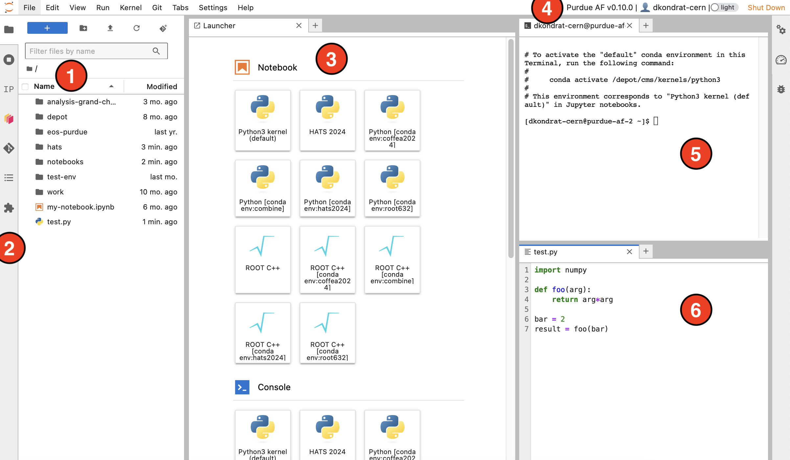
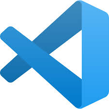

# How to use Purdue AF

## Basic interface components

JupyterLab provides an interactive interface for general code development.
The screenshot below shows the main elements of the interface:

<figure markdown="span">
  { width="900" }
</figure>

1. **File browser** — your home directory with symlinks to different storage volumes
   (Depot, CVMFS, `/work/`, etc. — learn more [here](storage.md)).
2. **Extensions** — the left sidebar contains useful extensions, such as a Git
   extension for interactive work with GitHub or GitLab repositories.
3. **Launcher** — features buttons to create Python and ROOT C++ notebooks with
   different Pixi or Conda environments, open terminals, create new text files, etc.
   A new Launcher window can be opened by clicking the `+` button in the file browser
   or next to any open tab.
4. **Top bar** — contains the Purdue AF release version, your username, a dark theme
   switch, and the shutdown button.
5. **Terminal** — standard Bash terminal, useful for anything that requires a
   command line interface.
6. **File editor** — simple IDE with syntax highlighting for most common programming
   languages.

!!! note

    Windows with terminals, editors, etc. can be rearranged freely. The window layout
    is preserved when you shut down and restart the AF session.

## Other user interfaces

In addition to JupyterLab, Purdue AF provides other user interfaces for analysis
development:

* **Web-based Visual Studio Code (code-server)** — to open it, click the button with
  the VSCode logo { height="20" } in the JupyterLab
  Launcher. You can also make VS Code the default interface of your session by
  selecting it in the **Interface** option when starting the session.
* [Connection from local VSCode-based IDEs](guide-ide-connection.md) (VSCode, Cursor, etc.)
* [SSH connection from a local terminal](guide-ssh-access.md)
* [Agentic interface (MCP server)](guide-agentic-interface.md) — manage your AF
  session and Dask clusters from any MCP-capable AI agent (Claude Code, Codex,
  Cursor, etc.)

## Python code development

JupyterLab is especially well suited for developing analysis workflows in Python.

* **Jupyter Notebooks** allow you to write analysis code as a sequence of code and
  text cells, which can be executed in arbitrary order. In many cases, a single
  Jupyter Notebook can accommodate a full analysis from data access to producing
  final plots.

    Jupyter Notebooks support a wide range of plugins and widgets, which allows for
    a more interactive experience compared to plain Python scripts.

* To execute the code in a Jupyter Notebook, you always need to specify a **kernel**.
  At Purdue AF, Jupyter kernels are derived from Pixi or Conda environments —
  read more in [Software stacks](software.md).
* We provide a curated ["global" Pixi environment](software.md), which should work
  for most applications, unless your code relies on a very specific package version.
* Analysis code written in Python can be accelerated via parallelization. We recommend
  using [Dask](guide-dask.md) for parallelization and distributed computing.
  For scaling out to multiple computing nodes, use [Dask Gateway](guide-dask-gateway.md).

## ROOT

[ROOT](https://root.cern) is a software package developed by CERN and widely used in
high energy physics for histogramming, fitting, and statistical analysis.

* The ROOT console can be launched from a terminal by typing `root -l`.
  Note that it is not possible to display canvases or open `TBrowser`, since the
  JupyterLab interface does not support X11 forwarding.
* Alternatively, you can turn a Jupyter Notebook into a ROOT console by selecting
  the **ROOT C++ kernel**. Similarly to Python notebooks, you can add text cells and
  execute cells in arbitrary order.

    When working from a Jupyter Notebook, you can display ROOT plots using the
    `TCanvas::Draw` method. [See an example of a ROOT C++ notebook here](demos/root-cpp.md).

* The pre-installed ROOT C++ kernel supports the **CUDA backend** for RooFit. To use
  it, pass the `RooFit::EvalBackend("cuda")` argument to `model.fitTo()` —
  see [Accelerating RooFit with GPUs](guide-roofit-cuda.md).
* In Python, ROOT functionality is accessible via the
  [PyROOT](https://root.cern/manual/python/) package, available in the global
  environment.

## HEP analysis frameworks

We aim to support a wide range of modern HEP analysis tools. Below are a few
examples of frameworks which have been shown to perform well at Purdue AF:

* [Coffea](https://coffeateam.github.io/coffea/) is a popular Python package
  for efficient columnar particle physics analyses. Coffea implements all common
  tools used in modern HEP analyses, and has a large and active support community.

    The latest version of Coffea is pre-installed in the global Pixi environment
    at `/work/pixi/global/`.

* [PocketCoffea](https://pocketcoffea.readthedocs.io/en/stable/) is a slim declarative
  framework built on top of Coffea. It allows you to define an analysis with a few
  configuration files. A PocketCoffea analysis can be executed in a distributed way
  using the
  [dask@purdue-af executor](https://pocketcoffea.readthedocs.io/en/stable/running.html#executors-availability),
  which is based on [Dask Gateway](guide-dask-gateway.md).

* [RDataFrame](https://root.cern.ch/doc/master/group__tutorial__dataframe.html) is
  another common HEP analysis framework based on ROOT. An RDataFrame analysis can
  be written in either C++ or Python. Purdue AF supports RDataFrame in any Pixi or
  Conda environment where ROOT is installed.

## Scaling out

When your analysis outgrows the resources of a single session, several options are
available — see [Scaling out](scaling-out.md) for a detailed comparison:

* **[Dask](guide-dask.md)** — parallelize any Python code over local cores, or
  scale out to hundreds of cores via [Dask Gateway](guide-dask-gateway.md)
  (available to all users).
* **Slurm** — batch submission to Purdue computing clusters (Purdue users only).
* **CRAB** — submission of CMSSW jobs to the Worldwide LHC Computing Grid.

## GPUs

At Purdue AF, you can start a session with a GPU by selecting it at the resource
selection step. We have a limited number of Nvidia A100 GPUs, available in two
configurations:

| Configuration       | Memory | Number of instances |
| ------------------- | ------ | ------------------- |
| Full A100 GPU       | 40 GB  | 4                   |
| 5 GB "slice" of A100 | 5 GB   | 14                  |

See [GPU access at Purdue AF](gpus.md) for more details.
