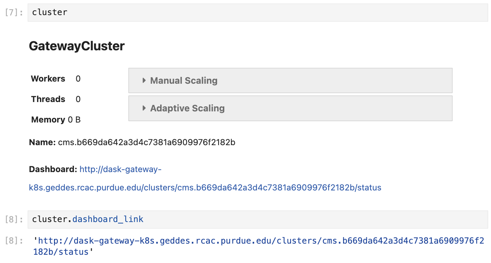

# Dask Gateway at Purdue AF

Dask Gateway is a service that allows users to manage Dask clusters in a
multi-tenant environment such as the Purdue Analysis Facility.

There are two gateways, one per backend:

* **Kubernetes backend** — workers are submitted to the Purdue Geddes cluster
  and are scheduled almost instantly. Available to **all users**.
* **Slurm backend** — workers are submitted as Slurm jobs to the Purdue
  **Hammer** community cluster, where they may wait in the queue behind other
  jobs. Available to **Purdue users only**, due to Purdue data access policies.

## Limits

| | Kubernetes backend | Slurm backend |
| --- | --- | --- |
| Active clusters per user | 1 | 1 |
| Workers per cluster | 200 (201 cores and 1200 GB of memory in total) | limited by Hammer availability |
| Cores per worker | up to 64 | up to 16 |
| Memory per worker | up to 64 GiB | up to 64 GiB |

The one-cluster limit applies per gateway: if cluster creation fails with a
message about an existing cluster, [shut the old cluster down](#5-shutting-down-clusters)
(or wait for it to finish stopping) first. For most analyses, many small
workers (1–4 cores each) work better than a few large ones.

## 1. Creating Dask Gateway clusters

To create a Dask Gateway cluster, you first connect to the Gateway server via a
`Gateway` object, and then use the `Gateway.new_cluster()` method.

Calling `Gateway()` without arguments connects you to the server with the
**Kubernetes backend**. In order to use the **Slurm** backend, you need to specify
the server URL explicitly (see code below).

While it is possible to create a cluster in a Python script, we recommend that you
instead do it from a separate Jupyter Notebook — that way the same cluster can be
reused multiple times without restarting.

```python
import os
import dask_gateway
from dask_gateway import Gateway

# To submit workers via Kubernetes (all users):
gateway = Gateway()

# To submit workers via Slurm to the Hammer cluster (Purdue users only!):
# gateway = Gateway(
#     "http://dask-gateway-k8s-slurm.geddes.rcac.purdue.edu/",
#     proxy_address="api-dask-gateway-k8s-slurm.cms.geddes.rcac.purdue.edu:8000",
# )

# Path to your VOMS proxy file, on storage the workers can read
# (see "Environment variables" below):
os.environ["X509_USER_PROXY"] = "/depot/cms/users/<username>/x509up_u<uid>"

# Create the cluster
cluster = gateway.new_cluster(
    pixi_project="/path/to/pixi/project",  # path to pixi project (directory containing pixi.toml file)
    # conda_env = "/path/to/conda/environment", # path to conda environment - can be used instead of pixi_project
    worker_cores=1,  # cores per worker
    worker_memory=4,  # memory per worker in GiB
    env=dict(os.environ),  # pass environment as a dictionary
)

# If working in a Jupyter Notebook, the following will create a widget
# which can be used to scale the cluster interactively:
cluster
```

## 2. Shared environments and storage volumes

Dask workers have the same permissions as the user that creates them, and see
only some of the storage volumes of your session — see which volumes each type
of worker can read in [Storage volumes](storage.md#overview). Any environment,
code, or data the workers use must live on one of those volumes.

### Pixi or Conda environments

A cluster runs the environment you name — it does not inherit the notebook's.
The environment must be built before the cluster is created, and stored where
the workers can read it: Slurm workers, for example, will not be able to see
environments located in `/work/` storage.

The path to a Pixi project is specified in the `pixi_project` argument of
`new_cluster()`:

```python
cluster = gateway.new_cluster(
    pixi_project="/path/to/pixi/project",  # path to pixi project (directory containing pixi.toml file)
    # ...
)
```

If you are using a
[multi-environment Pixi project](https://pixi.sh/dev/workspace/multi_environment/),
specify the environment name in the `pixi_env` argument (`default` if not
specified):

```python
cluster = gateway.new_cluster(
    pixi_project="/path/to/pixi/project",
    pixi_env="my-env",  # pixi environment name
    # ...
)
```

If using a Conda environment, specify its location in the `conda_env` argument
(mutually exclusive with `pixi_project` and `pixi_env`):

```python
cluster = gateway.new_cluster(
    conda_env="/path/to/conda/environment",  # path to conda environment
    # ...
)
```

### Environment variables

Workers inherit none of your session's environment variables; they receive
only what you pass in the `env` argument of `new_cluster()`. The most
straightforward way is to pass the entire session environment,
`env=dict(os.environ)`. This is also how you can, for example:

* enable imports from local Python (sub)modules by amending the `PYTHONPATH` variable;
* enable imports from C++ libraries by amending the `LD_LIBRARY_PATH` variable.

**Reading data via XRootD.** The environment passed to the workers must contain
`X509_USER_PROXY`, pointing to your VOMS proxy file on storage the workers
mount: `/depot/` for either backend, or `/work/users/<username>/` for the
Kubernetes backend only. By default `voms-proxy-init` writes the proxy to
`/tmp`, which workers cannot see, so set `X509_USER_PROXY` before
[creating the proxy](getting-started.md#6-set-up-a-voms-proxy):

```shell
export X509_USER_PROXY=/depot/cms/users/$USER/x509up_u$NB_UID
```

Passing `env=dict(os.environ)` then carries `X509_USER_PROXY` to the workers,
together with the session's `X509_CERT_DIR`, which is a `/cvmfs/` path.

!!! important

    For CERN and FNAL users, the dictionary passed to the `env` argument must
    contain the elements `"NB_UID"` and `"NB_GID"`. **This is already satisfied
    when you pass** `env = dict(os.environ)`, **so no further action is needed.**

    However, if you want to pass a custom environment to the workers, you can
    add the required elements as follows:

    ```python
    env = {
        "NB_UID": os.environ["NB_UID"],
        "NB_GID": os.environ["NB_GID"],
        # other environment variables...
    }
    ```

## 3. Monitoring

Monitoring your Dask jobs is possible in two ways:

1. Via the Dask dashboard, which is created for each cluster (see below).
2. Via the general Purdue AF monitoring page, in the "Dask Gateway" and "Slurm
   on Hammer" sections of the
   [monitoring dashboard](https://cms.geddes.rcac.purdue.edu/grafana/d/purdue-af-dashboard/purdue-analysis-facility-dashboard){ target="_blank" }.

When a cluster is created in a Jupyter Notebook, you can extract the link to the
dashboard either from the Dask Gateway widget, or from `cluster.dashboard_link`.

To create the widget, simply execute a cell containing a reference to the cluster
object, as shown in the screenshot:

<figure markdown="span">
  { width="700" }
</figure>

## 4. Cluster discovery and connecting a client

In general, connecting a client to a Gateway cluster is done as follows:

```python
client = cluster.get_client()
```

However, this implies that `cluster` refers to an already existing object. This is
true if the cluster was created in the same notebook, but in most cases we
recommend keeping the cluster separate from the clients.

Below are the different ways to connect a client to a cluster created elsewhere:

=== "Automatic cluster discovery"

    This snippet allows you to discover the cluster and connect to it
    automatically, as long as the cluster exists.

    ```python
    from dask_gateway import Gateway

    # If submitting workers as Kubernetes pods (all users):
    gateway = Gateway()

    # If submitting workers as Slurm jobs to Hammer (Purdue users only):
    # gateway = Gateway(
    #     "http://dask-gateway-k8s-slurm.geddes.rcac.purdue.edu/",
    #     proxy_address="api-dask-gateway-k8s-slurm.cms.geddes.rcac.purdue.edu:8000",
    # )

    clusters = gateway.list_clusters()
    # for example, select the first of the existing clusters
    cluster_name = clusters[0].name
    client = gateway.connect(cluster_name).get_client()
    ```

=== "Manual connection"

    This is the most straightforward method of connecting to a specific cluster.

    ```python
    from dask_gateway import Gateway

    # If submitting workers as Kubernetes pods (all users):
    gateway = Gateway()

    # If submitting workers as Slurm jobs to Hammer (Purdue users only):
    # gateway = Gateway(
    #     "http://dask-gateway-k8s-slurm.geddes.rcac.purdue.edu/",
    #     proxy_address="api-dask-gateway-k8s-slurm.cms.geddes.rcac.purdue.edu:8000",
    # )

    # To find the cluster name:
    print(gateway.list_clusters())

    # replace with actual cluster name:
    cluster_name = "17dfaa3c10dc48719f5dd8371893f3e5"
    client = gateway.connect(cluster_name).get_client()
    ```

## 5. Shutting down clusters

When you are done, shut the cluster down to release the resources for other users:

```python
cluster.shutdown()

# Or shut down a specific cluster by name:
# gateway.connect("17dfaa3c10dc48719f5dd8371893f3e5").shutdown()

# Or shut down all your clusters:
for cluster_info in gateway.list_clusters():
    gateway.connect(cluster_info.name).shutdown()
```

## 6. Cluster lifetime and timeouts

* Cluster creation fails if the scheduler doesn't start within **3 minutes**
  (Kubernetes backend) or **10 minutes** (Slurm backend). If this happens, try to
  resubmit the cluster.
* An idle cluster (no connected clients — for example, after the notebook that
  created it is terminated) is automatically shut down after **1 hour** with the
  Kubernetes backend, or after **24 hours** with the Slurm backend.
* With the Slurm backend, the underlying Slurm jobs have a walltime limit of
  **4 hours** — individual workers are terminated when they reach it.

!!! note "See also"

    * [Dask Gateway cluster setup (demo notebook)](https://github.com/PurdueAF/purdue-af-demos/blob/master/gateway-cluster.ipynb)
    * [Troubleshooting](troubleshooting.md#dask-gateway)
