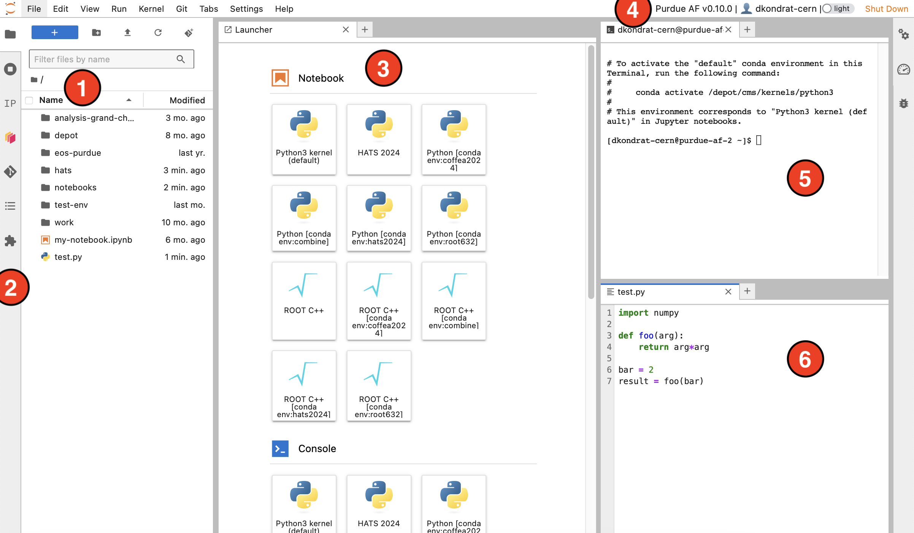

User interface (wip)
===========================

Basic interface components
---------------------------
JupyterLab provides an interactive interface for general code development.
The screenshot below shows the main elements of the interface:

#. **File browser** - your home directory with symlinks to different storage volumes (Depot, CVMFS, ``/work/``, etc. - learn more :doc:`here <doc-storage>`).
#. **Exstensions** - left sidebar contains useful extesions: an interactive :doc:`Dask Gateway <doc-dask-gateway>` interface, and a Git extension for interactive work with GitHub or GitLab repositories.
#. **Launcher** - features buttons to create Python and ROOT C++ notebooks with different Conda environments, open terminals, create new text files, etc.
   New launcher window can be opened by clicking the ``+`` button in the file browser or next to any open tab.
#. **Top bar** - contains Purdue AF release version, your username, dark theme switch, and the shutdown button.
#. **Terminal** - standard Bash terminal, useful for any cases that require a command line interface, such as ``voms-proxy-init``. You can also activate Conda environments here, run shell or Python scripts, use ROOT console, etc.
#. **File editor** - simple IDE with syntax highlight for most common programming languages.

.. note::

   Windows with terminals, editors, etc., can be rearranged. The window layout is preserved
   when you shut down and restart the AF session. 

Python code development
------------------------

JupyterLab is especially well suited for developing analysis workflows in Python.
* **Jupyter Notebooks** allow to write analysis code as a sequence of code and text cells,
  which can be executed in arbitrary order. In many cases, a single Jupyter Notebook can
  accomodate a full analysis from data access to producing final plots.

  Jupyter Notebooks support a wide range of plugins and widgets, which allows for a more
  interactive experience comparing to simple Python scripts.
* To execute the code in a Jupyter Notebook, we always need to specify a **kernel**.
  At Purdue AF, Jupyter kernels are derived from **Conda environments**. Read more about
  creating Conda environments and Jupyter kernels :doc:`here <guide-conda>`.
* We provide a :doc:`curated "default" Conda environment <doc-software>`, which should work 
  for most applications, unless your code relies on ``coffea 2024.x.x``, or a specific
  version of machine learning packages (``pytorch``, ``tensorflow``) different from what is
  present in the default environment. 

  .. important::

     In most cases, you will not need to create your own Conda environment.
     Try using the default environment first, and :doc:`contact Purdue AF admins <doc-support>`
     if there are any packages missing.

* Analysis code written in Python can be accelerated via parallelization. We recommend using
  :doc:`Dask <doc-dask>` for parallelization and distributed computing.
  For scaling out to multiple computing nodes, consider using :doc:`Dask Gateway <doc-dask-gateway>`.

ROOT
-------

* C++ kernel - use Jupyter as command line
* PyROOT
* WIP: CUDA backend

HEP analysis frameworks
-------------------------

* Coffea
* PocketCoffea
* RooDataFrame

Scaling out
------------

* Slurm
* Dask
* CRAB

GPUs
------