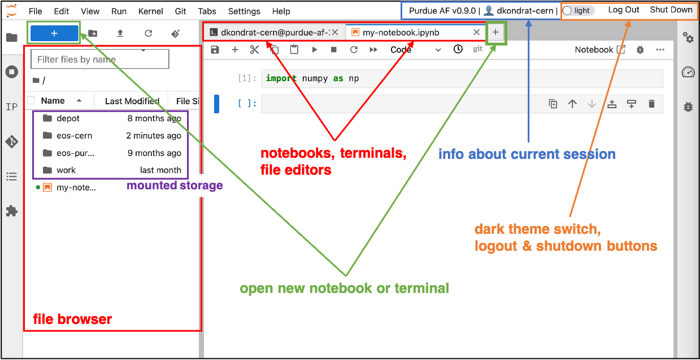

User interface
===========================

The Purdue Analysis Facility provides a user with a dedicated Kubernetes pod, which runs JupyterHub
with JupyterLab interface on top of AlmaLinux8 operating system. 

A JupyterLab session persists even if a user logs out or closes the browser tab;
the user can reconnect to the same session later, possibly from another device.
A session can be closed or restarted via the ``Shut Down`` button located in top right corner of the interface.

The sessions that are not closed manually will be closed automatically after **14 days** of inactivity.
This will delete all unsaved progress, but the user files in the ``/home/<username>/`` and ``/work/`` directories will be preserved.

The user data in ``/home/`` and ``/work/`` directories will be cleaned after **6 months** of user inactivity,
unless requested otherwise.

The Analysis Facility interface features the following functionality:

* Jupyter Notebooks with Python3 and ROOT C++ kernels. We provide :doc:`pre-installed kernels <doc-kernels>` ready for use in analyses.
* Interactive file browser

  * The file browser is based at user's dedicated home directory (``/home/<username>/``) with persistent 25GB storage.
  * Multiple mounted external storage volumes for data access and file sharing: :doc:`see available options <doc-storage>`.

* Interactive text editor
* Git extension for interactive work with GitHub or GitLab repositories
* Switch between light and dark themes