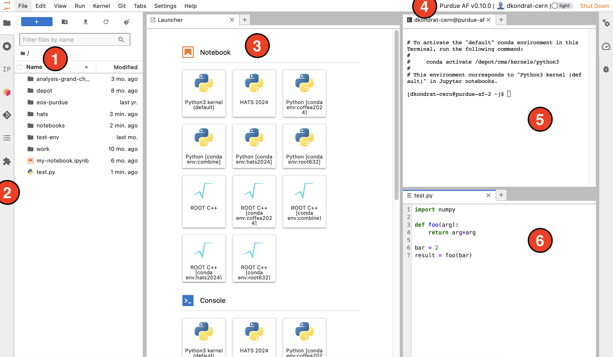

How to use Purdue AF
===========================

Basic interface components
---------------------------
JupyterLab provides an interactive interface for general code development.
The screenshot below shows the main elements of the interface:

#. **File browser** - your home directory with symlinks to different storage volumes (Depot, CVMFS, ``/work/``, etc. - learn more :doc:`here <doc-storage>`).
#. **Exstensions** - left sidebar contains useful extesions: an interactive :doc:`Dask Gateway <doc-dask-gateway>` interface, and a Git extension for interactive work with GitHub or GitLab repositories.
#. **Launcher** - features buttons to create Python and ROOT C++ notebooks with different Conda environments, open terminals, create new text files, etc.
   New launcher window can be opened by clicking the ``+`` button in the file browser or next to any open tab.
#. **Top bar** - contains Purdue AF release version, your username, dark theme switch, and the shutdown button.
#. **Terminal** - standard Bash terminal, useful for any cases that require a command line interface, such as ``voms-proxy-init``. You can also activate Conda environments here, run shell or Python scripts, use ROOT console, etc.
#. **File editor** - simple IDE with syntax highlight for most common programming languages.

.. note::

   Windows with terminals, editors, etc., can be rearranged. The window layout is preserved
   when you shut down and restart the AF session. 

Python code development
------------------------

JupyterLab is especially well suited for developing analysis workflows in Python.

* **Jupyter Notebooks** allow to write analysis code as a sequence of code and text cells,
  which can be executed in arbitrary order. In many cases, a single Jupyter Notebook can
  accomodate a full analysis from data access to producing final plots.

  Jupyter Notebooks support a wide range of plugins and widgets, which allows for a more
  interactive experience comparing to simple Python scripts.
* To execute the code in a Jupyter Notebook, we always need to specify a **kernel**.
  At Purdue AF, Jupyter kernels are derived from **Conda environments**. Read more about
  creating Conda environments and Jupyter kernels :doc:`here <guide-conda>`.
* We provide a :doc:`curated "default" Conda environment <doc-software>`, which should work 
  for most applications, unless your code relies on a specific
  version of ``pytorch`` or ``tensorflow``, or uses ``coffea==2024.X.X``.

  .. important::

     In most cases, you will not need to create your own Conda environment.
     Try using the default environment first, and :doc:`contact Purdue AF admins <doc-support>`
     if there are any packages missing.

* Analysis code written in Python can be accelerated via parallelization. We recommend using
  :doc:`Dask <doc-dask>` for parallelization and distributed computing.
  For scaling out to multiple computing nodes, consider using :doc:`Dask Gateway <doc-dask-gateway>`.

ROOT
-------

`ROOT <https://root.cern>`_ is a software package developed by CERN and widely used in
high energy physics for histogramming, fitting, and statistical analysis.

* ROOT console can be launched from a terminal by typing ``root -l``.
  Note that it is not possible to display canvases or open ``TBrowser`` as JupyterLab interface
  does not support X11 forwarding.
* Alternatively, you can turn a Jupyter Notebook into a ROOT console by selecting
  the **ROOT C++ kernel**. Similarly to Python notebooks, you can add text cells and execute
  cells in arbitrary order.
  
  When working from a Jupyter Notebook, you can display ROOT plots using ``TCanvas::Draw`` method.

  :doc:`See example of ROOT C++ notebook here <demos/root-cpp>`.
* In Python, ROOT functionality is accessiblae via `PyROOT <https://root.cern/manual/python/>`_ package, present in the default kernel.
* *Work in progress*: We are woking on enabling a CUDA backend for RooFit,
  in order to leverage GPU acceleration in ROOT workflows.

HEP analysis frameworks
-------------------------

We aim to support a wide range of modern HEP analysis tools.
Below are a few examples of frameworks which have been shown to perform well
at Purdue AF:

* `Coffea <https://coffeateam.github.io/coffea/>`_ is a popular Python package
  for efficient columnar particle physics analyses. Coffea implements all common
  tools used in modern HEP analyses, and has a large and active support community.

  In the default curated ``Python3 (default)`` kernel, we provide ``coffea==0.7.21``.

  Newer Coffea releases use calendar versioning scheme, e.g. ``coffea==2024.9.0``;
  these versions are incompatible with ``0.7.x`` and older versions.
  To access one of the latest Coffea versions, you can either use ``coffea_latest`` kernel,
  or :doc:`create your own kernel <guide-conda>`. If you want to use ``coffea_latest`` but
  missing some packages, please :doc:`contact Purdue AF admins <doc-support>` and we will install them for you.

* `PocketCoffea <https://pocketcoffea.readthedocs.io/en/stable/>`_ is a slim declarative
  framework built on top of Coffea. It allows to define an analysis with a few configuration
  files. A PocketCoffea analysis can be executed in a distributed way using
  `dask@purdue-af executor <https://pocketcoffea.readthedocs.io/en/stable/running.html#executors-availability>`_
  which is based on :doc:`Dask Gateway <doc-dask-gateway>`.

* `RDataFrame <https://root.cern.ch/doc/master/group__tutorial__dataframe.html>`_ is
  another common HEP analysis framework based on ROOT. RDataFrame analysis can
  be written in either C++ or Python. Purdue AF supports RDataFrame in any Conda
  environment where ROOT is installed, including default and ``coffea_latest`` environments.

Scaling out
------------

* `Slurm <https://slurm.schedmd.com/documentation.html>`_ is a job
  scheduler and workload manager that enables batch submission on Purdue
  computing clusters.  At Purdue AF, **users with local Purdue accounts**
  can submit jobs from Purdue AF to ``cms`` queue.
  
  `Instructions for submitting Slurm jobs <https://www.rcac.purdue.edu/knowledge/hammer/run>`_

* `Dask <https://docs.dask.org/en/stable/>`_  is an open-source library for parallel computing in Python. It can
  be used to :doc:`quickly parallelize any Python code <doc-dask>`,
  or implicitly as a backend in frameworks such as Coffea and RDataFrame.

  At Purdue AF, we host :doc:`Dask Gateway servers <doc-dask-gateway>`, which
  allow **users with both local and external (CERN/FNAL) accounts** to scale out
  beyond local session resources.

* `CRAB <https://twiki.cern.ch/twiki/bin/view/CMSPublic/SWGuideCrab>`_ (CMS Remote Analysis Builder) is a utility to submit CMSSW jobs
  to distributed computing resources. CRAB allows users to:

  * Access Data and Monte Carlo datasets stored at any CMS computing site
    worldwide.
  * Exploit the CPU and storage resources at CMS computing sites via
    Worldwide LHC Computing Grid (WLCG).

  CRAB is suitable for running most CMSSW framework jobs
  (i.e. jobs launched via the ``cmsRun`` command).
  It is recommended to use CRAB for computationally intensive jobs,
  such as Monte Carlo generation or "skimming" AOD / MiniAOD datasets.

  `Instructions for submitting CRAB jobs <https://www.physics.purdue.edu/Tier2/user-info/tutorials/crab3.php>`_

GPUs
------

At Purdue AF, you can start a session with a GPU by specifying it at resource selection step.

We have a limited number of Nvidia A100 GPUs, which are available in two configurations:

+----------------------+--------+---------------------+
| Configuration        | Memory | Number of instances |
+----------------------+--------+---------------------+
+----------------------+--------+---------------------+
| Full A100 GPU        | 40GB   | 4                   |
+----------------------+--------+---------------------+
| 5GB "slice" of A100  | 5GB    | 14                  |
+----------------------+--------+---------------------+

When GPU is selected, you session will have the following GPU software versions:

* Nvidia Driver Version: 535.129.03
* CUDA Version: 12.2

.. important::

   Please shut down your session after finishing GPU work to release the
   GPU for other users.