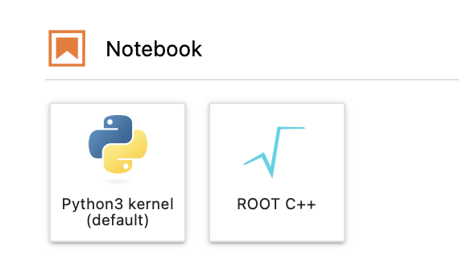

Software
==========================

The Purdue Analysis Facility provides several Jupyter kernels with pre-installed analysis software.
Users can also create their own kernels from scratch or from the existing kernels using the following instructions:
:doc:`guide-conda`.

The pre-installed kernels are listed below. The versions of the packages in these kernels are not fixed,
and will be occasionally upgraded.

**Python3 kernel (default)**

This kernel is designed for typical pythonic analysis workflows which do not include machine learning.
The kernel is based on Python 3.10. The following packages are installed:

* Scientific computing and data analysis: ``numpy``, ``scipy``, ``pandas``, ``awkward``, ``numba``,
  ``scikit-learn``, ``uncertainties``, ``lmfit``
* High energy physics tools: ``ROOT``, ``uproot``, ``coffea``, ``vector``, ``hist``, ``pyhf``
* Plotting: ``matplotlib``, ``mplhep``, ``plotly``
* Distributed computing: ``dask``, ``distributed``, ``dask-jobqueue``, ``dask-gateway``
* Other tools: ``xrootd``, ``pytest``, ``yaml``, ``tqdm``, ``ipywidgets``

**Python3 kernel [ML]**

This kernel includes all of the packages included into the default kernel,
and adds the most popular machine learning packages:

* ``tensorflow``
* ``pytorch`` and ``pytorch-geometric``
* ``keras``
* ``xgboost``

**ROOT C++ kernel**

This kernel provides an interactive interface to the ROOT command line,
allowing to execute ROOT macros and produce plots inside Jupyter notebooks.

   :doc:`ROOT C++ notebook demo <demos/root-cpp>`