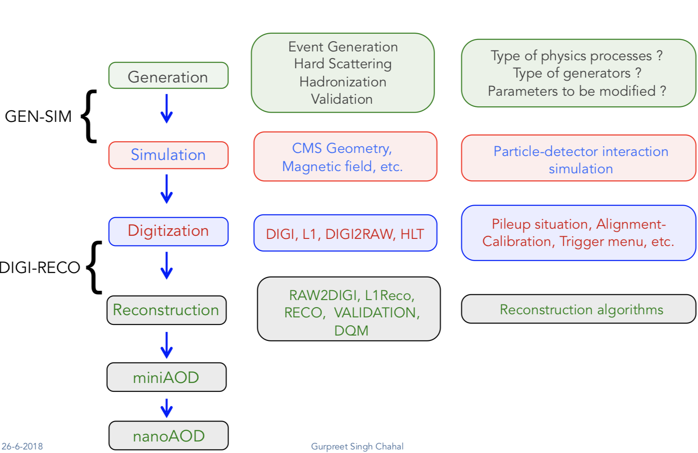

Private MC generation
======================

🏗️ Work in progress 🚧

This guide describes private MC production.
Comprehensive documentation about central MC production in CMS can be found here:
`<https://cms-pdmv.gitbook.io>`_.

We assume that we use ``MadGraph`` as our generator. 
In ``MadGraph``, we have different cards to define a process. 
Link to short MG tutorial : https://twiki.cern.ch/twiki/bin/view/CMSPublic/MadgraphTutorial

.. tabs::

   .. group-tab:: Run 2 UL

      In this example we are going to produce DY(pp → ll) samples.
      We define this process in ``MadGraph`` and it creates LHE files
      (python file with settings).

      Here, we are going to use ``UL18`` DY LHE file already produced by
      CMS PPD.

   .. group-tab:: Run 3

      .. caution::

         Will work only with ``slc8`` architectures. 

      In this example, the same conditions as in official samples
      (``Run3Summer22`` campaigns) are used.

      Conditions to keep in mind: 

      * GlobalTag
      * Detector alignment (CMSSW release)
      * HLT menus
      * NanoAOD versions

      Test sample : ``DYJetsToLL_M-50_TuneCP5_13p6TeV-madgraphMLM-pythia8``

Step 0: Create your gridpack
^^^^^^^^^^^^^^^^^^^^^^^^^^^^^

Step 1 : LHE → GEN → SIM
^^^^^^^^^^^^^^^^^^^^^^^^^^

.. tabs::

   .. group-tab:: Run 2 UL

      Download LHE file information and other PYTHIA (for hadronization)
      settings 

      For this step, we will use the ``CMSSW_10_6_30`` release. 

      .. code-block:: shell

         mkdir run2ul_mcgen
         cd run2ul_mcgen

         curl -s -k https://cms-pdmv-prod.web.cern.ch/mcm/public/restapi/requests/get_fragment/TAU-RunIISummer20UL18wmLHEGEN-00001 \
             --retry 3 \
             --create-dirs \
             -o Configuration/GenProduction/python/TAU-RunIISummer20UL18wmLHEGEN-00001-fragment.py 

         [ -s Configuration/GenProduction/python/TAU-RunIISummer20UL18wmLHEGEN-00001-fragment.py ] || exit $?;

         export SCRAM_ARCH=slc7_amd64_gcc700
         source /cvmfs/cms.cern.ch/cmsset_default.sh
         voms-proxy-init -voms cms

         cmsrel CMSSW_10_6_17_patch1
         cd CMSSW_10_6_17_patch1/src

         eval `scram runtime -sh`
         mv ../../Configuration .
         scram b -j8
         cd ../..

      Producing 10 events locally. For full production, please submit a CRAB job.

      .. code-block:: shell

         cmsDriver.py Configuration/GenProduction/python/TAU-RunIISummer20UL18wmLHEGEN-00001-fragment.py \
             --python_filename TAU-RunIISummer20UL18wmLHEGEN-00001_1_cfg.py \
             --eventcontent RAWSIM \
             --customise Configuration/DataProcessing/Utils.addMonitoring \
             --datatier GEN-SIM \
             --fileout file:TAU-RunIISummer20UL18GS.root \
             --conditions 106X_upgrade2018_realistic_v4 \
             --beamspot Realistic25ns13TeVEarly2018Collision \
             --customise_commands process.source.numberEventsInLuminosityBlock="cms.untracked.uint32(250)" \
             --step LHE,GEN,SIM \
             --geometry DB:Extended \
             --era Run2_2018 \
             --no_exec \
             --mc \
             -n 10

         cmsRun TAU-RunIISummer20UL18wmLHEGEN-00001_1_cfg.py 

   .. group-tab:: Run 3

      First we will download the process fragment
      (process definition, pythia settings , path to MGraph  gridpack) 
      from McM (Monte Carlo Production Management )

      .. code-block:: shell

         mkdir run3_mcgen
         cd run3_mcgen

         curl -s -k https://cms-pdmv-prod.web.cern.ch/mcm/public/restapi/requests/get_fragment/PPD-Run3Summer22wmLHEGS-00014 \
             --retry 3 \
             --create-dirs \
             -o Configuration/GenProduction/python/PPD-Run3Summer22wmLHEGS-00014-fragment.py

         [ -s Configuration/GenProduction/python/PPD-Run3Summer22wmLHEGS-00014-fragment.py ] || exit $?;

      Setting up the CMSSW release for this production chain.

      .. code-block:: shell

         export SCRAM_ARCH=el8_amd64_gcc10
         source /cvmfs/cms.cern.ch/cmsset_default.sh
         cmsrel CMSSW_12_4_14_patch3
         cd CMSSW_12_4_14_patch3/src
         eval `scram runtime -sh`
         mv ../../Configuration .
         scram b
         cd ../..

      Producing 10 events locally. For full production, please submit a CRAB job.

      .. code-block:: shell

         cmsDriver.py Configuration/GenProduction/python/PPD-Run3Summer22wmLHEGS-00014-fragment.py \
             --python_filename PPD-Run3Summer22wmLHEGS-00014_1_cfg.py \
             --eventcontent RAWSIM,LHE \
             --customise Configuration/DataProcessing/Utils.addMonitoring \
             --datatier GEN-SIM,LHE \
             --fileout file:PPD-Run3Summer22wmLHEGS-00014.root \
             --conditions 124X_mcRun3_2022_realistic_v12 \
             --beamspot Realistic25ns13p6TeVEarly2022Collision \
             --customise_commands process.RandomNumberGeneratorService.externalLHEProducer.initialSeed="int(123456)"\\nprocess.source.numberEventsInLuminosityBlock="cms.untracked.uint32(250)" \
             --step LHE,GEN,SIM \
             --geometry DB:Extended \
             --era Run3 \
             --no_exec \
             --mc \
             -n 10

         cmsRun PPD-Run3Summer22wmLHEGS-00014_1_cfg.py

      Output : ``PPD-Run3Summer22wmLHEGS-00014.root``

Step 1 will produce a ``GEN-SIM`` output file.

``GEN-SIM`` starts from a Monte Carlo generator, produces events at
generator level (the four-vectors of particles), and simulates
the energy released by the particles in the crossed detectors.

Important parameters for such campaigns are:

* Beamspot
* Generator fragment (specifies the process which needs to be generated)
* Detector geometry

Reference: https://cms-pdmv.gitbook.io/project/monte-carlo-management-mcm-introduction

Step 2 DIGI → L1 → DIGI2RAW → HLT
^^^^^^^^^^^^^^^^^^^^^^^^^^^^^^^^^^^^^^^

.. tabs::

   .. group-tab:: Run 2 UL

      With pile-up

      .. code-block:: shell

         cmsDriver.py  \
             --python_filename TAU-RunIISummer20UL18DIGI-00007_1_cfg.py \
             --eventcontent RAWSIM \
             --pileup 2018_25ns_UltraLegacy_PoissonOOTPU \
             --customise Configuration/DataProcessing/Utils.addMonitoring \
             --datatier GEN-SIM-DIGI \
             --fileout file:TAU-RunIISummer20UL18DIGI-00007.root \
             --pileup_input "dbs:/MinBias_TuneCP5_13TeV-pythia8/RunIISummer20UL18SIM-106X_upgrade2018_realistic_v11_L1v1-v2/GEN-SIM" \
             --conditions 106X_upgrade2018_realistic_v11_L1v1 \
             --step DIGI,L1,DIGI2RAW \
             --geometry DB:Extended \
             --filein file:TAU-RunIISummer20UL18GS.root \
             --era Run2_2018 \
             --runUnscheduled \
             --no_exec \
             --mc \
             -n 10

      Without pile-up

         .. code-block:: shell

            cmsDriver.py \
                --python_filename TAU-RunIISummer20UL18DIGI-00007_1_cfg.py \
                --eventcontent RAWSIM \
                --customise Configuration/DataProcessing/Utils.addMonitoring \
                --datatier GEN-SIM-DIGI \
                --fileout file:TAU-RunIISummer20UL18DIGI-00007.root  \
                --conditions 106X_upgrade2018_realistic_v11_L1v1 \
                --step DIGI,L1,DIGI2RAW \
                --geometry DB:Extended \
                --filein file:TAU-RunIISummer20UL18GS.root \
                --era Run2_2018 \
                --runUnscheduled \
                --no_exec \
                --mc \
                -n 10

      Output : ``TAU-RunIISummer20UL18DIGI-00007.root``

      **Adding the HLT objects /information.**

      For these samples: ``HLTv32`` is added, which is present in
      ``CMSSW_10_2_16_UL`` release - note that it is different
      from the originally used CMSSW release!.

      Create a new directory and set up ``CMSSW_10_2_16_UL`` release:

      .. code-block:: shell

         mkdir HLT_step
         cd HLT_step/
         export SCRAM_ARCH=slc7_amd64_gcc700
         source /cvmfs/cms.cern.ch/cmsset_default.sh

         cmsrel CMSSW_10_2_16_UL
         cd CMSSW_10_2_16_UL/src/
         voms-proxy-init -voms cms

         eval `scram runtime -sh`
         scram b

         cd ../..

         cmsDriver.py \
             --python_filename TAU-RunIISummer20UL18HLT-00011_1_cfg.py \
             --eventcontent RAWSIM \
             --customise Configuration/DataProcessing/Utils.addMonitoring \
             --datatier GEN-SIM-RAW \
             --fileout file:TAU-RunIISummer20UL18HLT-00011.root \
             --conditions 102X_upgrade2018_realistic_v15 \
             --customise_commands 'process.source.bypassVersionCheck = cms.untracked.bool(True)' \
             --step HLT:2018v32 \
             --geometry DB:Extended \
             --filein file:TAU-RunIISummer20UL18DIGI-00007.root \
             --era Run2_2018 \
             --no_exec \
             --mc \
             -n 10

         cmsRun TAU-RunIISummer20UL18HLT-00011_1_cfg.py

      Output: ``TAU-RunIISummer20UL18HLT-00011.root``

   .. group-tab:: Run 3

      With pile-up: 

      ``Neutrino_E-10_gun/Run3Summer21PrePremix-Summer22_124X_mcRun3_2022_realistic_v11-v2/PREMIX``

      .. code-block:: shell

         cmsDriver.py \
             --python_filename PPD-Run3Summer22DRPremix-00019_1_cfg.py \
             --eventcontent PREMIXRAW \
             --customise Configuration/DataProcessing/Utils.addMonitoring \
             --datatier GEN-SIM-RAW \
             --fileout file:PPD-Run3Summer22DRPremix-00019_0.root \
             --pileup_input "dbs:/Neutrino_E-10_gun/Run3Summer21PrePremix-Summer22_124X_mcRun3_2022_realistic_v11-v2/PREMIX" \
             --conditions 124X_mcRun3_2022_realistic_v12 \
             --step DIGI,DATAMIX,L1,DIGI2RAW,HLT:2022v12 \
             --procModifiers premix_stage2,siPixelQualityRawToDigi \
             --geometry DB:Extended \
             --filein file:PPD-Run3Summer22wmLHEGS-00014.root \
             --datamix PreMix \
             --era Run3 \
             --no_exec \
             --mc \
             -n 10

         cmsRun PPD-Run3Summer22DRPremix-00019_1_cfg.py

      Output : ``PPD-Run3Summer22DRPremix-00019_0.root``

Step3: AOD
^^^^^^^^^^^^^^^^^

.. tabs::

   .. group-tab:: Run 2 UL

      This step is performed with ``CMSSW_10_6_17_patch1``, which we already
      used in previous steps.

      We will switch to ``CMSSW_10_6_17_patch1`` and ``scram`` again to load
      ``CMSSW``-related libraries.

      .. code-block:: shell

         cmsDriver.py \
             --python_filename TAU-RunIISummer20UL18RECO-00011_1_cfg.py \
             --eventcontent AODSIM \
             --customise Configuration/DataProcessing/Utils.addMonitoring \
             --datatier AODSIM \
             --fileout file:TAU-RunIISummer20UL18RECO-00011.root \
             --conditions 106X_upgrade2018_realistic_v11_L1v1 \
             --step RAW2DIGI,L1Reco,RECO,RECOSIM,EI \
             --geometry DB:Extended \
             --filein file:TAU-RunIISummer20UL18HLT-00011.root \
             --era Run2_2018 \
             --runUnscheduled \
             --no_exec \
             --mc \
             -n 10

         cmsRun TAU-RunIISummer20UL18RECO-00011_1_cfg.py

      Output : ``TAU-RunIISummer20UL18RECO-00011.root``

   .. group-tab:: Run 3

      .. code-block:: shell
         
         cmsDriver.py \
             --python_filename PPD-Run3Summer22DRPremix-00019_2_cfg.py \
             --eventcontent AODSIM \
             --customise Configuration/DataProcessing/Utils.addMonitoring \
             --datatier AODSIM \
             --fileout file:PPD-Run3Summer22DRPremix-00019.root \
             --conditions 124X_mcRun3_2022_realistic_v12 \
             --step RAW2DIGI,L1Reco,RECO,RECOSIM \
             --procModifiers siPixelQualityRawToDigi \
             --geometry DB:Extended \
             --filein file:PPD-Run3Summer22DRPremix-00019_0.root \
             --era Run3 \
             --no_exec \
             --mc \
             -n 10

         cmsRun PPD-Run3Summer22DRPremix-00019_2_cfg.py 

      Output : ``PPD-Run3Summer22DRPremix-00019.root``

Step 4: MiniAOD
^^^^^^^^^^^^^^^^^
.. tabs::

   .. group-tab:: Run 2 UL

      ``MiniAODv2``

      This is supported in CMSSW versions starting from ``CMSSW_10_6_27``.

      .. code-block:: shell

         cmsDriver.py \
             --python_filename TAU-RunIISummer20UL18MiniAODv2-00015_1_cfg.py \
             --eventcontent MINIAODSIM \
             --customise Configuration/DataProcessing/Utils.addMonitoring \
             --datatier MINIAODSIM \
             --fileout file:TAU-RunIISummer20UL18MiniAODv2-00015.root \
             --conditions 106X_upgrade2018_realistic_v16_L1v1 \
             --step PAT \
             --procModifiers run2_miniAOD_UL \
             --geometry DB:Extended \
             --filein file:TAU-RunIISummer20UL18RECO-00011.root \
             --era Run2_2018 \
             --runUnscheduled \
             --no_exec \
             --mc \
             -n 10

         cmsRun TAU-RunIISummer20UL18MiniAODv2-00015_1_cfg.py

   .. group-tab:: Run 3

      ``MiniAODv4``

      For ``MiniAODv4`` and ``NanoAODv12``, we need a different ``CMSSW``
      release to include latest configuration.
      The centrally approved ``CMSSW`` release is ``CMSSW_13_0_13``.

      We will create a new directory for next steps. 

      .. caution::

         Please leave already existing ``CMSSW`` paths to avoid library and
         settings crash.

      .. code-block:: shell

         mkdir part2_setup
         cd part2_setup
         export SCRAM_ARCH=el8_amd64_gcc11
         source /cvmfs/cms.cern.ch/cmsset_default.sh
         cmsrel CMSSW_13_0_13
         cd CMSSW_13_0_13/src 
         eval `scram runtime -sh`
         scram b
         cd ../..

         cmsDriver.py  \
             --python_filename PPD-Run3Summer22MiniAODv4-00002_1_cfg.py \
             --eventcontent MINIAODSIM \
             --customise Configuration/DataProcessing/Utils.addMonitoring \
             --datatier MINIAODSIM \
             --fileout file:PPD-Run3Summer22MiniAODv4-00002.root \
             --conditions 130X_mcRun3_2022_realistic_v5 \
             --step PAT \
             --geometry DB:Extended \
             --filein file:PPD-Run3Summer22DRPremix-00019.root \
             --era Run3,run3_miniAOD_12X \
             --no_exec \
             --mc \
             -n 10

         cmsRun PPD-Run3Summer22MiniAODv4-00002_1_cfg.py
      
      Output : ``PPD-Run3Summer22MiniAODv4-00002.root``

Step 5 : NanoAOD
^^^^^^^^^^^^^^^^^^
.. tabs::

   .. group-tab:: Run 2 UL

      ``NanoAODv9``

      For more details:
      https://gitlab.cern.ch/cms-nanoAOD/nanoaod-doc/-/wikis/Instructions/Private-production

      .. code-block:: shell

         mkdir nano_step
         cd nano_step
         source /cvmfs/cms.cern.ch/cmsset_default.sh
         export SCRAM_ARCH=slc7_amd64_gcc700
         voms-proxy-init -voms cms
         cmsrel CMSSW_10_6_26
         cd CMSSW_10_6_26/src/
         eval `scram runtime -sh`
         scram b 
         cd ../..

         cmsDriver.py \
             --python_filename TAU-RunIISummer20UL18NanoAODv9-00020_1_cfg.py \
             --eventcontent NANOAODSIM \
             --customise Configuration/DataProcessing/Utils.addMonitoring \
             --datatier NANOAODSIM \
             --fileout file:TAU-RunIISummer20UL18NanoAODv9-00020.root \
             --conditions 106X_upgrade2018_realistic_v16_L1v1 \
             --customise_commands "process.add_(cms.Service('InitRootHandlers', EnableIMT = cms.untracked.bool(False))) \\n from PhysicsTools.NanoAOD.custom_jme_cff import PrepJMECustomNanoAOD_MC; PrepJMECustomNanoAOD_MC(process)" \
             --step NANO \
             --filein file:TAU-RunIISummer20UL18MiniAODv2-00015.root \
             --era Run2_2018,run2_nanoAOD_106Xv2 \
             --no_exec \
             --mc \
             -n 10

         cmsRun TAU-RunIISummer20UL18NanoAODv9-00020_1_cfg.py

   .. group-tab:: Run 3

      ``NanoAODv12``

      .. code-block:: shell

         cmsDriver.py \
             --python_filename PPD-Run3Summer22NanoAODv12-00002_1_cfg.py \
             --eventcontent NANOEDMAODSIM \
             --customise Configuration/DataProcessing/Utils.addMonitoring \
             --datatier NANOAODSIM \
             --fileout file:PPD-Run3Summer22NanoAODv12-00002.root \
             --conditions 130X_mcRun3_2022_realistic_v5 \
             --step NANO \
             --scenario pp \
             --filein file:PPD-Run3Summer22MiniAODv4-00002.root \
             --era Run3 \
             --no_exec \
             --mc \
             -n 10

         cmsRun PPD-Run3Summer22NanoAODv12-00002_1_cfg.py 

      Output :  ``PPD-Run3Summer22NanoAODv12-00002.root``

*This tutorial was prepared by Amandeep Kaur and Dmitry Kondratyev @ Purdue University CMS group.*
