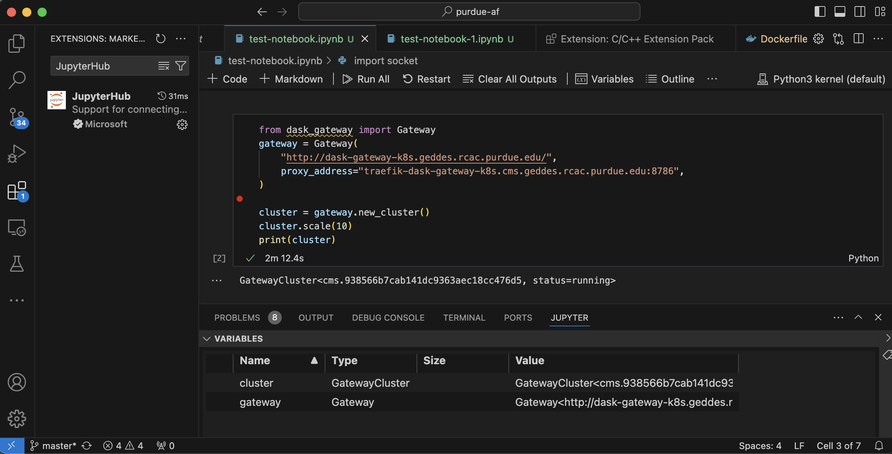

VSCode integration
================================

.. image:: https://upload.wikimedia.org/wikipedia/commons/thumb/9/9a/Visual_Studio_Code_1.35_icon.svg/240px-Visual_Studio_Code_1.35_icon.svg.png
   :width: 30
   :align: left

`Visual Studio Code <https://code.visualstudio.com>`_ is currenlty the most popular
integrated development environment (IDE).

Purdue AF + VSCode use cases
~~~~~~~~~~~~~~~~~~~~~~~~~~~~~~~~

- Running local notebooks with remote Conda environments (Jupyter kernels), which ensures that
  you use exactly the same versions of packages without a need to reinstall the environment.
- Scaling out directly from you computer using :doc:`Dask Gateway <doc-dask-gateway>` instances at Purdue AF.

Installation instructions
~~~~~~~~~~~~~~~~~~~~~~~~~~~~~~~~

1. **Install VSCode and JupyterHub extension**

   1.1. `Install VSCode <https://code.visualstudio.com>`_.

   1.2. Open the "Extensions" panel in VSCode sidebar.

   1.3. Search for ``JupyterHub`` extension and install it.

2. **Create or open a Jupyter notebook**

   2.1. Open a local Jupyter notebook that you want to use with Purdue AF, or create a new notebook.

   2.2. You may need to install ``Jupyter`` extension for VSCode for better experience.

3. **Obtain authentication token for your AF session**

   3.1. In a web browser, `login to Purdue AF and start a session <https://cms.geddes.rcac.purdue.edu>`_.

   3.2. Go to ``File -> Hub Control Panel``.

   3.3. Click ``Token`` tab in top left of the page.

   3.4. Click ``Request new API token`` to obtain the token string - you will need it in the next step.

4. **Connect your notebook to AF session**

   4.1. Switch back to the notebook opened in VSCode.

   4.2. In the top right corner of the notebook, click ``Select kernel`` button, which will open Command Palette.

   4.3. In the Command Palette, select ``Existing JupyterHub Server``.

   4.4. When prompted for URL of the server, paste ``https://cms.geddes.rcac.purdue.edu``.

   4.5. When prompted for username:

        - If you are using Purdue account, type your Purdue username.

        - If you are using CERN account, type your CERN username followed by ``-cern``.

        - If you are using Fermilab account, type your FNAL account followed by ``-fnal``.

   4.6. When prompted for token or password, paste the token obtained in step 3.

   4.7. Type any name (e.g. "Purdue AF") to save the JupyterHub server setup for future.

5. **Select kernel**

   5.1. Once setup is complete, you will be able to choose from the Purdue AF kernels, including default Python kernels, as well as any custom Conda environments that you normally have access to.

   5.2. To change kernel in the notebook, simply click on ``Select Kernel`` in top right corner, and choose from recently used kernels or click ``Select Another Kernel`` and then ``Existing JupyterHub Server``. You will not need to repeat steps 4.4 - 4.7.

6. (optional) **Start a Dask Gateway cluster**

   Follow :doc:`instructions to start Dask Gateway cluster from a Jupyter notebook <doc-dask-gateway>` -
   they will work in your local notebook in VSCode too, but interactive widgets will
   not be displayed.
